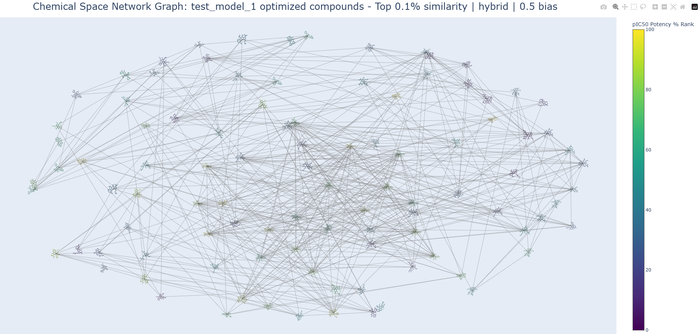
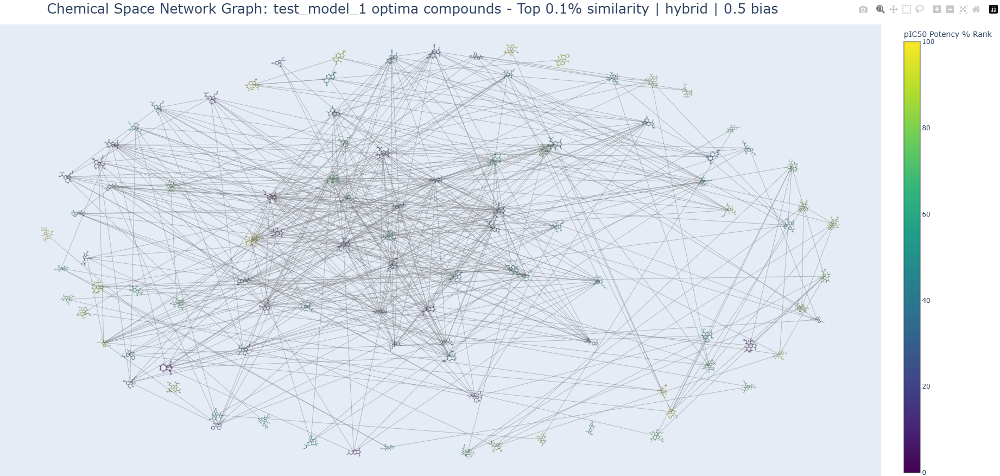
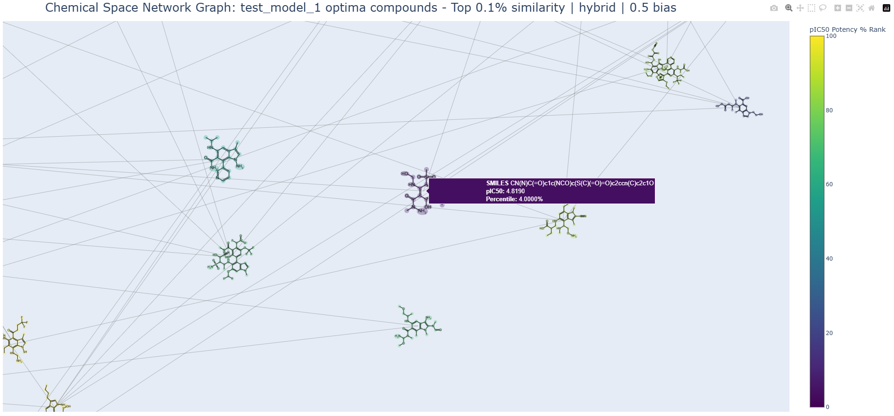
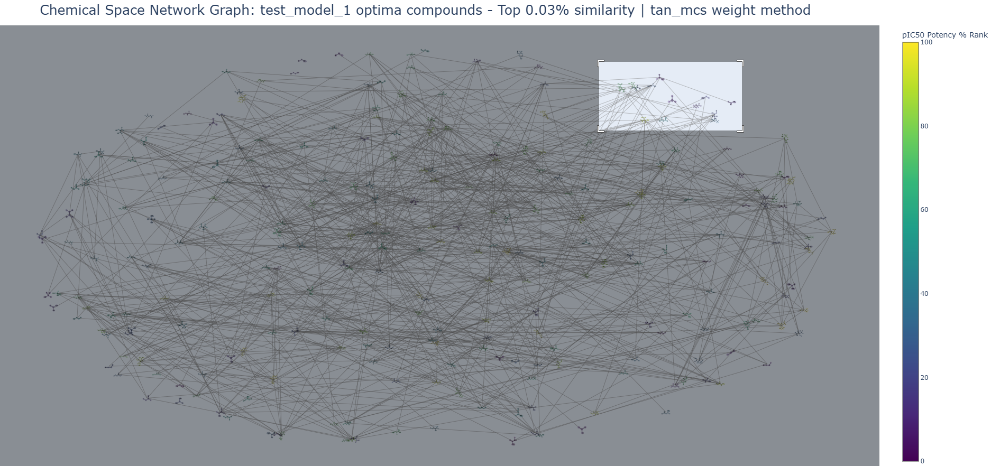
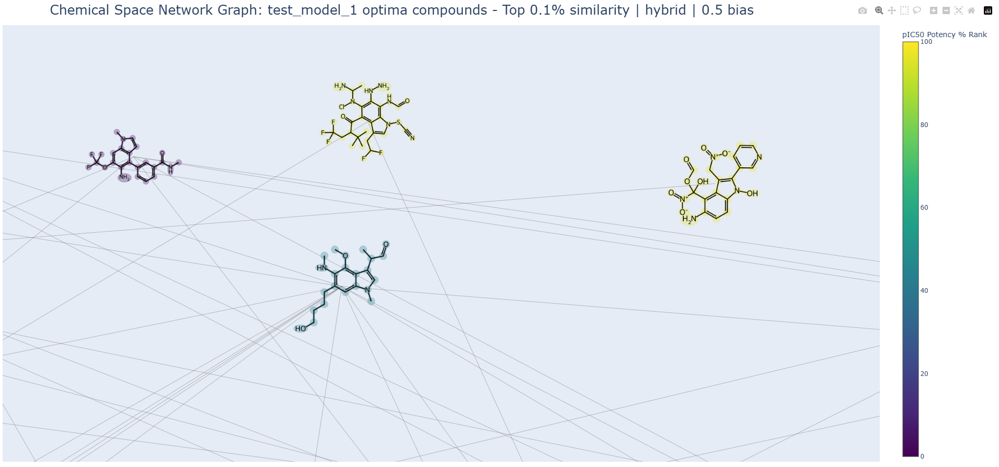

## NOCTURNAL
[](https://git.io/typing-svg)
- developed by: Elliot Chan
- contact: elliotchan120@gmail.com

> A machine learning-enhanced end-to-end platform integrating machine learning, cheminformatics, molecular optimization and interactive chemical space analysis.
> Aiming to accelerate drug candidate identification and optimization by exploring the dark chemical space.


## Abstract

NOCTURNAL is a python framework that combines ChEMBL database mining, machine learning-based potency prediction, and molecular optimization for drug discovery workflows.
As long as a ChEMBL dataset exists for any given disease or target protein of interest, users can leverage ML models for potency predictions to be made on candidate molecules.

The system can then deploy these models in a unique drug optimization algorithm, 'MutaGen', to generate optimized molecular candidates while maintaining drug-like properties. These compounds can then be graphed through the interactive chemical space network (CSN) visualization module 'ChemNet'.


## Key Features
**Database Integration**
- automatically searches ChEMBL database (large drug discovery data repository) for target protein of interest
- ranks potential datasets by size and source, helping you select the desired training data

**Machine Learning Pipeline**
- build models using 3 different algorithms: RandomForest, XGBoost, or a Stacking Ensemble combining multiple approaches
- automatic hyperparameter tuning and rigorous cross-validation ensures model reliability and performance

**Robust Error-Handling**
- everything configurable through 0_config.yaml file
- choose preferred ML algorithm and adjust default settings without touching code

**Smart Molecular Dataset Processing**
- a05_csnodes handles large molecular datasets for visualization, balancing chemical diversity against computation time

**MutaGen**: Molecular Optimization Engine
- Leverages a curated molecular fragment library to intelligently modify drug molecules, using ML models to predict new molecule potencies
- Employs optimization plateau-breaking strategies 
- 3 molecular changes possible: adding fragments, replacing atoms, removing fragments / atoms
- Automatically filters out molecules that violate drug-likeness rules

**ChemNet**: Interactive Visualization Tool
- Creates interactive drug-network graphs showing chemical similarity relationships between molecules
- Structurally similar molecules appear closer together
- Color-codes molecules by potency
- Hover over any molecule to see its structure, potency value and ranking


#### Intelligent Adaptation
The system adjusts to your data, from error thresholds in optimization to graph density in visualization. No need for manual tuning on dozens of parameters for each new project.

#### End-to-End Workflow
From database search to molecule optimization and visualization, all in one platform.

#### Handles Complexity
Gracefully handles outliers, missing data and edge cases. Prevents computational bottlenecks with intelligent sampling. validates chemical structures at every step to ensure drug-like molecules are all you get.

## Workflow with Core Classes

```python
# 1 ChEMBL data scouting for quantity and source 
# params: Target protein, List Size
def demo_datascout():
    data_scout("Tau", 20)

# 2 ChEMBL data acquisition and processing 
#  params: Target protein, Index #, Fingerprint setting (all xml settings in padel_fp_xmls)
def demo_dataseekprocess():
    DataSeekProcess("Tau", 25, "PubChem").run()

# 3 ML model training and evaluation 
# param: ML model name
def demo_modelbuilder():
    ModelBuilder('test_model_1').build()

# 4 given a .smi file containing chemical smiles, predict all compounds' potencies
# params: ML model (trained), SMILES file in "input_folder"
def demo_runmodel():
    RunModel("test_model_1", "benchmark_smile").run_predictions()

# [NOTE]
# MutaGen (below) is going to output two csv's of interest: optimized and optima molecules
# Optima: molecules that failed to improve 'x' amount of times (3 default)
# Optimized: molecules that improved past the potency unit target_increase (1 default: 10x)

# 5 take the most potent compound from file and attempt to generate optimized molecules with MutaGen
# param: ML model (trained and ran a SMILES file)
def demo_optimizecompound():
    MutaGen('test_model_1').init_optimize()

    
# [NOTE]
# At this point, you should look at the optimized and optima datasets produced in the "predictions" folder...
# and take note of datasets resulting in 200+ molecules and/or ones with highly complex molecules
# The downstream module a05_csnodes.py greatly increases in time needed to perform their calculations,
# which is why I added in the intelligent sampling capabilities to suit the needs of the user / dataset

# For optimized, I only want to see the compounds that gave me the highest potency / performance.
# For optima, I care more about the chemical diversity of the set.
# So I selected performance for the optimized compounds, and balanced for the optima compounds


# 6 generate chemical space network data for both optimized and optima compounds
# params: ML model (trained, SMILES file and MutaGen outputs present), compound type, sampling strategy (None by default)
def csn_data(model_name):
    if __name__ == '__main__':
        csn_dataprocessor(model_name, "optimized", filter_strategy='performance')
        csn_dataprocessor(model_name, "optima", filter_strategy='balanced')

csn_data('test_model_1')
        

# 7 generate CSN interactive graphs for both compound types
# params: ML model (same requirements as previous)
# NOTE: the filter_strategy has to be consistent for the compound type, otherwise the specific files won't be found
def csn_network(model_name, weight_method):
    ChemNet(model_name, "optimized", weight_method, filter_strategy='performance').graph_data()
    ChemNet(model_name, "optima", weight_method, filter_strategy='balanced').graph_data()

csn_network('test_model_1', 'hybrid')
```

### MutaGen Sample Output
- Model: test_model_1 
- Molecule dataset: Tau | Index 25
- Lead Compound: CHEMBL176896,CC(=O)O/N=C1/C(c2c(O)[nH]c3ccccc23)=Nc2ccccc21,6.071247040738312
- Config settings: see Configuration section of the readme

*Optimized Molecules (First 3 out of 64)*
> ,Target SMILES,pIC50 Values
> 
>0,N=C1C(c2c(O)[nH]c3ccccc23)=Nc2cc(S(=O)O)ccc21,7.165922800132628
> 
>3,O=S(O)c1ccc2c(c1)N=C(c1c(O)[nH]c3ccccc13)C2,7.165922800132628
> 
>4,O=S(O)c1ccc2c(c1Br)N=C(c1c(O)[nH]c3ccccc13)C2,7.165922800132628

*Optima Molecules (First 3 out of 332)*
> ,Optima SMILES,pIC50 Values
> 
> 0,O/N=C1/C(c2c(O)[nH]c3ccccc23)=Nc2ccccc21,6.856223652437791
> 
> 1,CC(=O)O/N=C1/C(c2c(O)[nH]c3ccc(C4COCCN4)cc23)=Nc2ccccc21,5.334240219776008
> 
> 2,CC(=O)O/N=C1/C(c2c(O)[nH]c3ccc(N)cc23)=Nc2ccccc21,5.503766679455064

*Final Mutant Compounds (First 3 out of 20)*
>,Final SMILES Candidates,pIC50 Values
>
> 0,N#CC1C(c2c(O)[nH]c3ccccc23)=Nc2c(I)c([SH]=O)c(Cl)c(F)c21,7.165922800132628
>
> 1,O=[SH]c1cccc2c1C(=NC(F)(F)F)C(c1c(O)[nH]c3cc(O)ccc13)=N2,7.08580895024169
>
> 2,O=[SH]c1cc(O)c2c(c1)N=C(c1c(O)[nH]c3ccc(Br)cc13)C2,7.08580895024169

As we can see from this benchmark run, we have just taken an experimentally validated compound tested against the Tau protein (CHEMBL176896) and computationally generated 64 potential optimized candidates with increased pIC50 values of 1+.
That is a 10x (minimum) increase in potency than what the benchmark compound originally possessed.

### ChemNet CSN Graph Demo
Note: These are from a previous demonstration run.
- Molecule dataset: Tau | Index 25
- Model: test_model_1
- Optimized graph settings: filter_strategy='performance'
- Optima graph settings: filter_strategy='balanced'
- Config settings: see Configuration section of the readme
<table>
  <tr>
    <td></td>
    <td></td>
  </tr>
  <tr>
    <td align="center">Optimized Compound CSN Graph</td>
    <td align="center">Optima Compound CSN Graph</td>
  </tr>
</table>

When we hover our mouse over each node / molecule we get their info: SMILES string, pIC50 % rank, and raw pIC50 value.
<div align="center">
  
  <p><em>Hover text demonstration in the optima compound CSN graph</em></p>
</div>

If you think that the molecules are too cluttered or hard to see, we can either zoom in to the section you want to see, or set both 2D molecular imaging and transparent nodes to "False" in the config's second-last section. For the latter, you will have to rely on the SMILES to analyze the drug structure.
<table>
  <tr>
    <td></td>
    <td></td>
  </tr>
  <tr>
    <td align="center">Screenshot showing which CSN region we are magnifying</td>
    <td align="center">The magnified region</td>
  </tr>
</table>


### Model Performance Metrics
During training, the following metrics are assessed and output in the assessments folder
- **Cross-validation and Test set Assessment**
  - Model name and algorithm type
  - Hyperparameters (If applicable)
  - Mean R^2, RMSE, and MAE
- **Gridsearch (Hyperparameter Optimization) results**
- **Feature Importance**
- **Regression Plot**


## Configuration

All parameters are configurable via `config.yaml`, this is a demo section:
```yaml
# =====================================
# MutaGen SETTINGS
# =====================================
candidates: 20    # how many copies of the starting molecule you want to undergo mutations
iterations: 100   # how many times you want to introduce random mutations
target_increase: 1  # this is how much of an increase in pIC50 you are aiming to obtain from the optimized molecule
error_threshold: -0.05   # when we hit a plateau, how much are you willing to sacrifice in performance temporarily?
success_threshold: 0.05   # what is the minimum performance increase you will accept?
retain_threshold: 3  # how many times the molecule can fail to improve before exploring other optimization routes


# =====================================
# CSNodes SETTINGS
# sampling strategy options: balanced, performance, mcs_optimized
# =====================================
target_size: 100   # the target amount of nodes you want to show up in the CSN visualizations
# Note: please use when coming across big datasets (200+) and using one of the sampling strategies to prevent bottlenecks


# =====================================
# ChemNet SETTINGS
# =====================================
colorscale: Viridis
transparent_nodes: True  # makes nodes transparent if True -> lets you see the molecules better
node_toggle: True   # keeps / removes nodes
label_toggle: False  # just displays the hover text
2D_molecules: True  # displays 2D structures
node_size: 2
# NOTE: this is only active when the weight_method parameter for ChemNet is 'hybrid'
tanimoto_bias: 0.5  # determines how much weight the plot is biased towards: overall similarity (1) or maximum common substructure (0)
```


## Prerequisites and Dependencies
- Python 3.7+
- Required packages:
    - requests
    - chembl_webresource_client
    - pandas
    - numpy
    - rdkit
    - padelpy -> also search online and download the PaDEL descriptor software package
    - scikit-learn
    - xgboost
    - seaborn
    - matplotlib
    - pyyaml
    - plotly
    - networkx

    
## Third-Party Components
- ChemNet and CSNodes contains portions of code and methodologies that were adapted from Vincent F. Scalfani's work: CSN_tutorial (BSD 3-Clause Licence)
- Please see NOTICE file for copyright notice

*Key Modifications Made:*
- Integrated with NOCTURNAL's ML training pipelines and drug optimization algorithm "MutaGen" -> specialized to output chemical space network graphs for the optimized and optima compounds that are produced with MutaGen
- Modularized codeblocks into classes and function toolsets to:
	a) generate calculated data (Tanimoto similarity, MCS)
	b) visualize the chemical space network
- intelligent node sampling modes to prevent performance bottlenecks in pairwise similarity calculations
- pIC50 determines highlight colour instead of pKi
- Edge weight for constructing the CSN graph can be changed between Tanimoto similarity, MCS, or a hybrid method combining both, where the bias towards one can be set in the config file -> 'tanimoto_bias' (default = 0.5)
- Replaced matplotlib with Plotly for interactive visualization
- Implemented adaptive 2D molecular image sizing
- Adaptive network density to subset size
- Graph cosmetic customizability from config file
- Interactive nodes with hover text displaying: SMILES, pIC50 % rank, pIC50
- Various error handling blocks 

