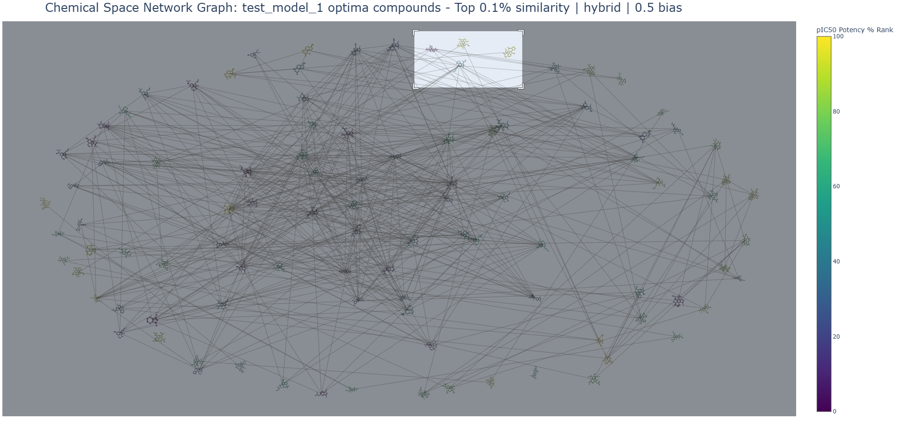

## NOCTURNAL
*Exploring the dark chemical space*
- developed by: Elliot Chan
- contact: elliotchan120@gmail.com

> A machine learning-enhanced end-to-end platform integrating machine learning, cheminformatics, molecular optimization and interactive chemical space analysis.
> Aiming to accelerate drug candidate identification and optimization by exploring the dark chemical space.


## Abstract

NOCTURNAL is an integrated computational framework that combines ChEMBL database mining, machine learning-based potency prediction, and stochastic molecular optimization for drug discovery workflows. The system employs a novel evolutionary algorithm 'MutaGen' to generate optimized molecular candidates while maintaining drug-like properties, which are graphed through the interactive chemical space network visualization module 'ChemNet'.

## Key Features

*Architecture*
- **Database Integration**
  - Initial ChEMBL querying ranks potential target protein datasets by data quantity and displays data source / quality
- **ML Pipeline**
  - Modular architecture supporting Random Forest, XGBoost, and Stacking models with automated hyperparameter optimization
  - Rigorous evaluation protocols implement cross-validation with performance metrics
- **Config-driven Customization**
  - 0_config.yaml file allows for configuration of ML algorithm type when training models as well as the default settings
- **Error Handling and Validation**
  - Custom exception classes (e.g. ModelBuilderError, RunModelError) provide targeted feedback, guiding users toward any issues
  - Config file-loading coupled with validation of config keys and required directories ensures consistent runtime and prevents pipeline-breaking errors
  - Graceful fallback mechanisms implemented throughout critical points throughout the pipeline, such as in PaDEL fingerprinting and ChemNet visualizations

*Core Modules*
- **MutaGen: NOCTURNAL's Molecular Optimization Module**
  - An advanced molecular optimization algorithm integrating adaptive, dynamic algorithmic design, cheminformatics, machine learning, and optimization theory
  - Performs chemically informed SMILES-based molecular mutations with RDKit, coupled with machine learning predictions on pIC50 values
  - Implements adaptive local optima escape mechanisms that dynamically adjust error thresholds, aiming to escape pIC50 plateaus during chemical space exploration
  - Multi-modal mutation strategies: addition, replacement, removal with specially curated fragment libraries for aromatic and non-aromatic atoms
  - Integrated Lipinski rule filtering for oral bioavailability assessments
- **ChemNet: NOCTURNAL's Chemical Space Network Visualization Module**: 
  - Interactive chemical space networks with similarity-based clustering
  - Intelligent network scaling responsiveness to edge data quantity preserves visual clarity
  - 2D structure molecular imaging, with molecule colours indicating % rank potency, simultaneously handling outliers
  - Multi-modal similarity system: supports graph generation based on overall, substructure or hybrid structural similarity between molecules


## Workflow with Core Classes

```python
# 1 ChEMBL data scouting for quantity and source 
# params: Target protein, List Size
def demo_datascout():
    data_scout("Tau", 20)

# 2 ChEMBL data acquisition and preprocessing 
#  params: Target protein, Index #
def demo_dataseekprocess():
    DataSeekProcess("Tau", 25, "PubChem").run()

# 3 ML model training and evaluation 
# param: ML model name
def demo_modelbuilder():
    ModelBuilder('test_model_1').build()

# 4 given a .smi file containing chemical smiles, predict all compounds' potencies
# params: ML model (trained), SMILES file
def demo_runmodel():
    RunModel("test_model_1", "benchmark_smile").run_predictions()

# 5 takes the most potent compound from file and attempt to optimize it with MutaGen
# param: ML model (trained and ran a SMILES file)
def demo_optimizecompound():
    MutaGen('test_model_1').init_optimize()

# 6 generate chemical space network graphs for both optimized and optima compounds
# param: ML model (trained, SMILES file and MutaGen outputs present)
def csn_data(model_name):
    if __name__ == '__main__':
        csn_dataprocessor(model_name, "optimized")
        csn_dataprocessor(model_name, "optima")
```

### MutaGen Sample Output
- Model: test_model_1  --> latest iteration
- Molecule dataset: Tau | Index 25
- Lead Compound: CC(C)Nc1ccc2c(c1)c(C)cn2C, 5.118979726577529
- Config settings: see Configuration section of the readme

*Optimized Molecules (First 3 out of 442)*
>,Target SMILES,pIC50 Values
> 
>0,CCCCc1cc2c(c(CCO)cn2C)c(C(=O)CC)c1NC(C)C,6.347707068175809
> 
>2,Cc1c(C#N)n(C)c2ccc(NC(C)C)c(C3COCCN3)c12,6.122732753600296
> 
>4,CCCCc1c(NC(C)C)c(C(=O)CC)c2c(CCO)cn(C)c2c1N(CC)CC,6.411037333223118

*Optima Molecules (First 3 out of 222)*
>,Optima SMILES,pIC50 Values
> 
>0,CC(C)Nc1ccc2c(c1)c(C)cn2C,5.118979726577529
> 
>1,CCCCc1cc(NC(C)C)cc2c(C)cn(C)c12,5.200036623932273
> 
>3,Cc1cn(C)c2c(C#N)cc(NC(C)C)cc12,5.200036623932273

*Final Mutant Compounds (First 3 out of 20)*
>,Final SMILES Candidates,pIC50 Values
> 
>0,NS(=O)(=O)CC1(OC=O)CCCC(F)(c2c(F)cc3c([SH]=O)c(OC(F)(F)F)n(NC(S)O[SH](=O)=O)c3c2-c2cccnc2)N1,6.514708531475597
> 
>1,CCC(C)Nc1c(Cl)cc2c(c1O)c(S)c(C(C)=O)n2S,6.314668516453233
> 
>2,CCc1c(N(O)NO)c(N)c(SC)c2c1c(C)cn2CCN,6.192498368269378

### ChemNet CSN Graph Demo
- Molecule dataset: Tau | Index 25
- Model: test_model_1 from a previous README.md version, these are not the same molecules as above
- Config settings: see Configuration section of the readme
<table>
  <tr>
    <td></td>
    <td></td>
  </tr>
  <tr>
    <td align="center">Optimized Compound CSN Graph</td>
    <td align="center">Optima Compound CSN Graph</td>
  </tr>
</table>

When we hover our mouse over each node / molecule we get their info: SMILES string, pIC50 % rank, and raw pIC50 value.
<div align="center">
  
  <p><em>Hover text demonstration in the optimized compound CSN graph</em></p>
</div>

If you think that the molecules are too cluttered or hard to see, we can either zoom in to the section you want to see, or set both 2D molecular imaging and transparent nodes to "False" in the config's second-last section. For the latter, you will have to rely on the SMILES to analyze the drug structure.
<table>
  <tr>
    <td></td>
    <td></td>
  </tr>
  <tr>
    <td align="center">Screenshot showing which CSN region we are magnifying</td>
    <td align="center">The magnified region</td>
  </tr>
</table>

## Architecture
*This section goes in detail to the core algorithms and background processes that make NOCTURNAL sophisticated and unique*

**[1] Config-driven architecture and automatic config key + folder validations**
- The 0_config.yaml file allows for customizability of a lot of core processes, like how many attempts one wishes to attempt at making molecular fingerprints as well as default parameters for training future machine learning models
- Furthermore, file b01_utility.py contains many custom error classes that help pinpoint the user towards the source of any mishaps during runs. E.g. ModelBuilderError, RunModelError etc.
- The validate_config() function in b01_utility is called upon every single class instantiation throughout the entire pipeline: it validates that all the keys in the config file, and all the required folders are present in their respective places. If those conditions are fulfilled, it loads the config file. Otherwise a custom “ConfigurationError” is raised.
- The get_fingerprint() function allows for automatic fingerprint type detection upon properly selecting an ML model for running or optimization.


**[2] Navigation-aided approach**
- data_scout()’s aim is to facilitate decision-making by automatically sorting data indices by largest IC50 data entries to lowest, and it takes this one step further by outputting data quality information, such as where the data came from. This is relevant since its generally better to train models on larger amounts of higher quality data.


**[3] ModelBuilder’s modular feature organization**
- Class ModelBuilder allows one to choose what kind of model to build among the choices RandomForestRegressor, XGBoostRegressor, and Stacking RFR, XGBR, and SVR with Ridge as the meta-learner.
- RFR and XGBR go through hyperparameter optimization using GridSearchCV, while Stacking remains default (computationally expensive and time-consuming on top of greater overfitting risk on smaller datasets. I might still add it in later on though).
- All models go through sequential model evaluation: hold-out test set followed by k-fold cross validation. Model evaluation metrics such as R^2, RMSE, MAE along with model performance and feature importance graphs are saved to the assessments folder.


**[4] MutaGen’s algorithm system: multi-modal optimization framework integrating stochastic search, adaptive heuristics, and machine learning**
- Stochastic chemical space exploration: the algorithm system utilizes a random_mutation() function to randomly introduce fragment addition, atom replacement and removal to simulate chemical space exploration
- Adaptive heuristic approach to local optima escape: the new compound must fulfill two rules to pass on to the next iteration:
    1. It must have a pIC50 value improvement greater than a specified configurable amount (default = 0.05)
    2. It must fulfill minimum 2/4 Lipinski rules of oral bioavailability
    - If it fails to meet one of these, it does not make it through to the next iteration and the previous is kept. A “retain counter” integer associated with each candidate compound is incremented by +1. When this number reaches 3 (config's retain_threshold), the molecule is deemed an "optima" compound, and the rules to pass on change, allowing mutations resulting in negative pIC50 decreases to -0.5. As the retain_count continues to increase, the room for error decreases. The idea behind this is to explore the nearby chemical space with the goal of producing high-performance compounds.

- Mutations are guided by a curated set of two bioactive fragment libraries specialized for aromatic and non-aromatic atoms, improving the chemical realism of generated structures.
- Chemical validity filters: all mutations are first validated using valence checks and RDKit sanitizations. Fragment size filters are also applied to remove unstable or irrelevant candidates.
- Adaptive Logic to protect compounds: Short SMILES are protected from being destabilized further or eliminated by removal mutations, and hydrogen atoms are never used as connection points so valencies are constantly kept in check.
- If a molecule ends up being fragmented, the largest fragment is taken, this is to prevent downstream functions from failing.
- Catches all molecules that met or surpassed a desired improvement in pIC50, compounds that were deemed local optima i.e. could not improve after a certain amount of tries, on top of the final candidates.
    - Outputs all as 3 separate dataframes for targeted analysis.

    
**[5] ChemNet - NOCTURNAL's Visualization Engine**
- ChemNet represents a sophisticated chemical space visualization system, bridging ML predictions with interactive network analysis
- Processes ML optimization outputs from MutaGen for both optima and optimized molecular sets, facilitating Structure Activity Analysis and drug discovery workflows

- Intelligent network scaling via dynamic edge filtering and density-responsiveness allows for automatic adjustments to edge-density, 2D molecule size, and spacing depending on how much total data is available.
- Multi-modal similarity system: allows for tanimoto fingerprint, MCS and a flexible hybrid mode to determine which method of similarity measure will shape the CSN graph.
- 2D structure molecular imaging of all molecules, complemented with color-coordinated highlighting to match potency percentile rankings
- Handles outliers and data distribution through percentile normalization 
- Adaptive sizing algorithm automatically calculates optimal molecular image sizes based on network density and layout boundaries, and computes node distribution to prevent overlap and maximize visibility
- SMILES strings, % pIC50 rank, and raw pIC50 values appear in hover tooltips
- Multi-stage data validation with a custom exception class and graceful fallback mechanisms to prevent breaking the entire visualization, as well as comprehensive file operation safety checks.


## Future Improvements
- MutaGen adaptive fragments and further improvements to kekulization of certain compounds
- Choose which molecule to start optimizing: lead candidate (input), lead from database, or custom HC chain
- More CSN statistics
- logging instead of print statements
- Benchmarking functions
- Datascout improvements - IC50 range

### Model Performance Metrics
During training, the following metrics are assessed and output in the assessments folder
- **Cross-validation and Test set Assessment**
  - Model name and algorithm type
  - Hyperparameters (If applicable)
  - Mean R^2, RMSE, and MAE
- **Gridsearch (Hyperparameter Optimization) results**
- **Feature Importance**
- **Regression Plot**


## Configuration

All parameters are configurable via `config.yaml`, this is a demo section:
```yaml
# =====================================
# MutaGen SETTINGS
# =====================================
candidates: 20    # how many copies of the starting molecule you want to undergo mutations
iterations: 100   # how many times you want to introduce random mutations
target_increase: 1  # this is how much of an increase in pIC50 you are aiming to obtain from the optimized molecule
error_threshold: -0.05   # when we hit a plateau, how much are you willing to sacrifice in performance temporarily?
success_threshold: 0.05   # what is the minimum performance increase you will accept?
retain_threshold: 3  # how many times the molecule can fail to improve before exploring other optimization routes

# =====================================
# ChemNet SETTINGS
# =====================================
colorscale: Viridis
transparent_nodes: True  # makes nodes transparent if True -> lets you see the molecules better
node_toggle: True   # keeps / removes nodes
label_toggle: False  # just displays the hover text
2D_molecules: True  # displays 2D structures
node_size: 2
# NOTE: this is only active when the weight_method parameter for ChemNet is 'hybrid'
tanimoto_bias: 0.5  # determines how much weight the plot is biased towards: overall similarity (1) or maximum common substructure (0)

```


## Prerequisites and Dependencies
- Python 3.7+
- Required packages:
    - requests
    - chembl_webresource_client
    - pandas
    - numpy
    - rdkit
    - padelpy -> also search online and download the PaDEL descriptor software package
    - scikit-learn
    - xgboost
    - seaborn
    - matplotlib
    - pyyaml
    - plotly
    - networkx

    
## Third-Party Components
- ChemNet and CSNodes contains portions of code and methodologies that were adapted from Vincent F. Scalfani's work: CSN_tutorial (BSD 3-Clause Licence)
- Please see NOTICE file for copyright notice

*Key Modifications Made:*
- Integrated with NOCTURNAL's ML training pipelines and drug optimization algorithm "MutaGen" -> specialized to output chemical space network graphs for the optimized and optima compounds that are produced with MutaGen
- Modularized codeblocks into classes and function toolsets to:
	a) generate calculated data (Tanimoto similarity, MCS)
	b) visualize the chemical space network
- pIC50 determines highlight colour instead of pKi
- Edge weight for constructing the CSN graph can be changed between Tanimoto similarity, MCS, or a hybrid method combining both, where the bias towards one can be set in the config file -> 'tanimoto_bias' (default = 0.5)
- Replaced matplotlib with Plotly for interactive visualization
- Implemented adaptive 2D molecular image sizing
- Adaptive network density to subset size
- Graph cosmetic customizability from config file
- Interactive nodes with hover text displaying: SMILES, pIC50 % rank, pIC50
- Various error handling blocks 

