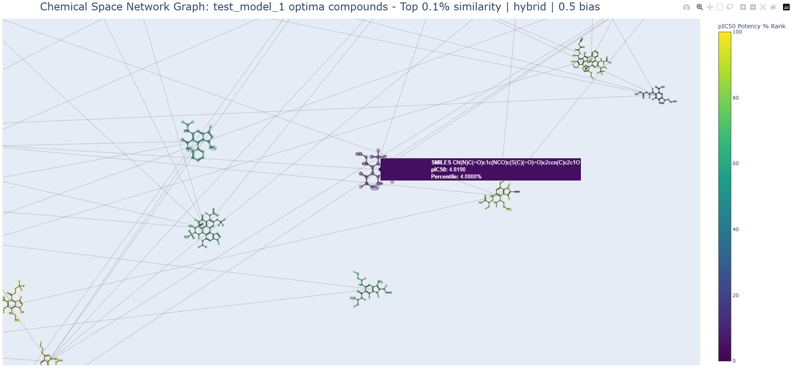

## NOCTURNAL

*Exploring the dark chemical space.*

- developed by: Elliot Chan
- contact: elliotchan120@gmail.com

## [1] Overview - for busy readers.

NOCTURNAL (v2.4.0) is a ChEMBL database navigation-aided interface for training ML models on drug-protein potency & compound molecular fingerprint analysis. Models can then be used to perform the following:
- Predict candidate compounds’ potencies (pIC50 values) against the respective target protein.
- Optimize drug candidate structures by being deployed in a molecular optimization algorithm system, (class MutaGen,) that stochastically explores chemical space, aiming to generate improved drug candidate analogs, aided with heuristic techniques to bring an overall increase in potency while maintaining oral bioavailability properties of all candidates produced.

The molecules generated by MutaGen can then be visualized in a Chemical Space Network graph where they are separated by similarity. Users can see the chemical molecules 2D structures, highlighted in various colours depending on their potency % rank. The graph is interactive, allowing one to hover their mouse over the chemical structures / nodes to see the information, such as its string format (e.g. O=C(CCl)NOCl), it's % rank by potency and its pIC50 value.


All of this occurs within a modular, fault-tolerant architecture aimed at accelerating drug discovery workflows.

## [2] Project Flow Overview - How to use it!

If you’re not a super busy reader, let me take you through a test run of my project. Everything here is executable in 01_main.py, which is where I put some functions that call on the files of this project. Usage of this project may need a bit of understanding so I hope this helps allow the reader to utilize it no matter the level they’re at. 

**[1] Data Scouting - Seeing what target to… target**

Firstly, a target protein has to be selected. I was interested in the Tau protein in Alzheimer’s at the time of making this project. So we’ll be using that as an example. 

‘target_input’ is the target protein you want to look at, ‘size’ is how many options you want to see.

```python
data_scout(target_input = “Tau”, size = 20)
```

data_scout will query the ChEMBL database for drug data on that target protein, and output data as such:

> INDEX[25] CHEMBL1907600 | Homo sapiens | PROTEIN COMPLEX | 2447 IC50 entries
> 
> INDEX[12] CHEMBL2366565 | Sus scrofa | PROTEIN FAMILY | 753 IC50 entries
> 
> INDEX[13] CHEMBL2828 | Homo sapiens | SINGLE PROTEIN | 703 IC50 entries
> 
> INDEX[23] CHEMBL4036 | Homo sapiens | SINGLE PROTEIN | 475 IC50 entries

What does all of this mean?

IC50: What concentration of ‘x’ do I need to inhibit a biological target ‘y’ by 50%?

pIC50 = -log_10(IC50) → it is a measure of potency. Higher = more potent, note that IC50 is in Molarity (M)

Data indices (INDEX[X]) are automatically ranked according to number of IC50 entries, which we will later convert into pIC50, a measure for drug effectiveness. What we see above is the first 4 results. Each entry contains a chemical compound that was tested against that target protein, and had its IC50 value recorded. With some more data processing that occurs in the next class, we can obtain their chemical formulas as a string called SMILES, which looks like this: “O=C1Cc2c([nH]c3ccc(Br)cc23)-c2cc(Br)ccc2N1” - CHEMBL98360

**[2] Data Processing and Model Training**

Let’s say I wanted to use the first option, which is data index number ‘25’, I selected it since its got the greatest amount of IC50 entries and the data source is Homo sapiens | PROTEIN COMPLEX so it's relevant to us. Now I want to build a ML model using this data. I will first call on DataSeekProcess, pass on the target protein name and index, then say .run()

```python
DataSeekProcess(target_protein = “Tau”, selected_target_index = 25, fingerprint_setting = “PubChem”).run()
```

“PubChem” refers to the specific settings that we use for molecular fingerprint generation. If you didn’t understand that, welcome to the club. Joking. Think of a molecular fingerprint as a way to represent chemical structures as 1’s and 0’s (that’s basically it). There’s various fingerprinting settings that we can select in the “PADEL SETTINGS” → “settings” section of the config file, which will affect how each molecular substructure is encoded in the final dataframe, which we build our machine learning models on. 

Once it’s done running, the “database” folder will have generated a bunch of files, which you don’t need to worry about for now. What DataSeekProcess has done is essentially created a DataFrame (CSV file) containing each compound’s molecular fingerprints and their potencies / pIC50 values.

When we call on class ModelBuilder, it will access our database folder and look at the file we just produced with DataSeekProcess. This is actually a good time to backtrack and note that I actually designed this class with modularity to select which machine learning algorithm you wish to choose. The current options are RandomForestRegressor, XGBoosting, and Stacking, which you can put in “ml_model_type” in the “MODEL TRAINING SETTINGS”. Here’s a brief rundown of what each one does. If you’re an expert on machine learning feel free to correct me on this.

- **RandomForestRegressor**: builds a lot of decision trees from random data subsets + features, then averages their predictions. It works well with “noisy” and non-linear data.
- **XGBoost / XGBRegressor**: builds trees sequentially, where each tree learns from the mistakes of the previous ones. It’s fast, accurate, and handles missing data.
- **Stacking**: trains multiple base models - I chose RandomForestRegressor, XGBRegressor, and Support Vector Regression. Each base model makes predictions while a “meta-learner” (Ridge Regression) looks over them and learns how to combine them. It leverages the strengths of multiple algorithms, and is usually more accurate than any single model.
    - This cranked my CPU temperature to 79 celsius though, so that may be a drawback if your operating system is on the low end.

That was a lot. Well, now we can actually build the machine learning model! We don’t need to pass anything on to it other than the name we want to give our model.

```python
ModelBuilder("test_model_1”).build()
```

After running this, we now have a folder named “test_model_1” in the “ml_models” folder as well as a few performance metrics about our model in the assessments folder (explained in the core features section of this readme). Inside this folder is the machine learning model saved as a .pkl file and a .txt file called “[name]_settings.txt”. We need both, as the settings file serves as a filter for future data to be passed through and be accessible by the ML model we made. 

We now have built a machine learning model that can predict ANY chemical compound’s pIC50 / potency against the “Tau” protein! Let’s see how we’re gonna do exactly that.

**[3] Running predictions!**

Remember at the start when we saw a SMILES string (e.g. CCC(=O)O...) ? Every chemical compound has a representation as a SMILES. Let’s say you’re in a lab and they want to explore how compounds ‘x’, ‘y’, ‘z’, ‘x2’, ‘y2’, ‘z2’ will perform against a certain disease, whose target protein they’ve identified and entries already exist in ChEMBL… 

Well, I’m not in a lab (yet); I’m in a basement, and I don’t have advanced chemical compounds from a lab, I have my old organic chemistry II notes from which I gathered a few random chemicals and put through an online “chemical name to SMILES converter”. I then put these SMILES into a file called “test_smile.smi” which we need to move to the “input_folder”. The file looks like this:

> filename: test_smile.smi
> 
> C1CCCCC1	Cycloh  exane
> 
> CCO	Eth   anol
>
> CC(=O)O	Acetic  acid
> 
> CCCCCC	Hexane
> 
> C1=CC=CC=C1	Ben  zene
> 
> CC(C)O	hljkjkh   iuhh iuh iu
> 
> C1CCOC1	   Tetrahydr  ofuran (THF)
> 
> C(C(=O)O)N	Glycine
> 
> CCN(CC)CC
> 
> O=C(C)Oc1ccccc1C(=O)O	Aspi   rin
> 

Wait, why are all the names (and not the SMILES…) messed up? My bad, my hands cramped from writing this extensive README. Anyway, it doesn’t matter, because when we call on class RunModel and feed it this file, it will automatically validate it, and output its validated version. It will have a “VALID_” followed by your submitted file’s original name in the “input_folder”:

> filename: VALID_test_smile.smi
> 
> C1CCCCC1	Cyclohexane
> 
> CCO	Ethanol
> 
> CC(=O)O	Aceticacid
> 
> CCCCCC	Hexane
> 
> C1=CC=CC=C1	Benzene
> 
> CC(C)O	hljkjkhiuhhiuhiu
> 
> C1CCOC1	Tetrahydrofuran(THF)
> 
> C(C(=O)O)N	Glycine
> 
> CCN(CC)CC	compound_1
> 
> O=C(C)Oc1ccccc1C(=O)O	Aspirin
> 

Note how the second last compound didn’t have a name originally but now has the name “compound_1”.

This is all done automatically when you call on the class, so let’s look at what we need to pass on to it. We didn’t say test_model_1.pkl or test_smile.smi, we just used the raw names with no file suffixes. 

```python
RunModel(model_name = “test_model_1”, input_smiles_filename = “test_smile”).run_predictions()
```

What happens when we run this, is our “test_smile” is validated, then each molecule is converted into a molecular fingerprint with the “PubChem” setting. Next, our model reads that file, and predicts how potent each molecule is going to be against the target protein it was originally trained against: Tau. The predictions are output in a folder called “predictions” along with a bar chart visually representing the data. 

> Molecule ID                  SMILES                                  pIC50
> 
> 
> 
> | Cyclohexane | C1CCCCC1 | 4.909786429476615 |
> 
> | Ethanol | CCO | 4.823817551315969 |
> 
> | Aceticacid | CC(=O)O | 4.977223857317889 |
> 
> | Hexane | CCCCCC | 4.838476784385388 |
> 
> | Benzene | C1=CC=CC=C1 | 4.909786429476615 |
> 
> | hljkjkhiuhhiuhiu | CC(C)O | 4.9389590279949935 |
> 
> | Tetrahydrofuran(THF) | C1CCOC1 | 4.92096979543497 |
> 
> | Glycine | C(C(=O)O)N | 4.526465737739071 |
> 
> | compound_1 | CCN(CC)CC | 4.817367072558987 |
> 
> | Aspirin | O=C(C)Oc1ccccc1C(=O)O | 4.834832673200845 |


It should also be noted that pIC50 values of 6+ are generally strong, while 4- are pretty weak. This is just a sample of examples, but you can test it out using the actual database drugs, which can be found inside the database folder, in file “3_pIC50_dataclass.csv”. I just used these since they’re not super complicated / long.

Wow, in a couple lines of code (and a lot of reading, I’m sorry,) we managed to predict how effective these compounds would be against Tau proteins! If you think this is cool, you’re right, but I think we can go a couple steps further.

**[4] Molecular Optimization: generating new chemical compounds!**

The *crown jewel* of this entire project. I named the class algorithm system *MutaGen* as it essentially “MUTAtes” chemical compounds and “GENerates” new compound analogs, which will most likely have an increased pIC50 value by the end of the function. 

It should be noted that I have no clue if this exact algorithm may be novel, I developed it independently from 1-6am after a random epiphany and am unaware of any identical implementations in the field. I do intend to tweak it in the future with the purpose of optimized results. Let’s run the algorithm.

We call MutaGen like so:

```python
MutaGen(model_name = ‘test_model_1’).init_optimize()
```

This is what it you should see at the start in your text editor’s window after running:

> Starting SMILES
> 
> ['CC(=O)O', 'CC(=O)O', 'CC(=O)O', 'CC(=O)O', 'CC(=O)O', 'CC(=O)O', 'CC(=O)O', 'CC(=O)O', 'CC(=O)O', 'CC(=O)O']
> 
> Iteration 0 / 100
> 
> [0, 0, 0, 0, 0, 0, 0, 0, 0, 0]

This is what it should look like after a little bit of runtime. 

> Iteration 61 / 100
> 
> [1, 1, 1, 2, 1, 2, 0, 3, 1, 1]
> 
> keeping original
> 
> C.N.O=CO.OS: 5.106306685986625 -- Retain_Count = 2
> 
> keeping original
> 
> NCC(CCC(F)SF)C(N)COCF.O: 5.584522383428918 -- Retain_Count = 2
> 
> keeping original
> 
> CN.Cl.O.OCCO.ON(S)S: 5.01309550301873 -- Retain_Count = 2
> 
> keeping original
> 
> C=O.N.NCCCO: 5.32517189253863 -- Retain_Count = 3
> 
> keeping original
> 
> CF.O.O.O=COO.OF: 5.109178672239924 -- Retain_Count = 2
> 
> keeping original
> 
> OOOF: 5.021848840128122 -- Retain_Count = 3
> 
> keeping original
> 
> Br.N.OCN(F)NO.S: 4.943618929310658 -- Retain_Count = 1
> 
> CCNC(=O)OC(O)CNC: 5.180781883373486 -- Retain_Count = 0
> 
> keeping original
> 
> [CCO.CO.NC](cco.o.co)(N)(O)CNO.O.O: 5.1246622653017635 -- Retain_Count = 2
> 
> keeping original
> 
> O=C(O)NOCO: 5.131364864065399 -- Retain_Count = 2
> 

You may be super confused right now, thinking "What am I even looking at? What is 'Retain_Count'? Can you get a job now?". Firstly, ouch, the market is really bad right now. Second, let me first explain what the algorithm is doing behind the scenes. Heads up, if I mention any algorithm setting that you can configure, it will look like this: (config -> variable that is configurable). You could also go to the config file to the "molecule optimizer settings" section and read what each setting does, or you could read along.

What happens first, is that the most potent molecule that you submitted in the input file is taken and copied 20 times (by default). These 20 copies (config -> candidates) then undergo stochastic / random chemical mutations individually, and then have their potencies predicted using the ML model we selected (in this case, test_model_1 from before). 
e.g. CC(=O)O, 4.977 ---[add CC]---> CCCC(=O)O, 5.05


Now the algorithm compares the potencies from before and after, then decides from there whether to continue mutating the molecule or keep the original. If the new molecule has an improved potency by 0.05+ (config -> success_threshold) it "passes" and moves on to the next round of mutations. Molecules that do not see an improvement by 0.05+, whether they fail or don't improve enough, do not make it to the next round of mutations and their "Retain_Count" increases by 1. In the example above, 5.05 - 4.977 is larger than 0.05, so it makes it to the next round of mutations.


The Retain_Count represents the amount of times a molecule has failed to improve, and what happens is that if the molecule fails to improve 3 times (config -> retain_threshold) they are now silently removed from the group and tortured in a black site. Joking. What happens is that their requirement to improve actually lowers then gradually increases as Retain_Count continues to get larger. This depends on the user-defined config variable "error_threshold" which is default at -0.05. It sounds counterintuitive, but the idea behind initially decreasing the error threshold then slowly strictening the requirements is that we're allowing the molecules to explore new chemical paths in a more performance driven manner, filtering for molecules that will produce greater improvements. It's like telling your kid "okay you can switch majors, but you better get A's".

Now you must be wondering, "When does the program know when to stop? Is there an end goal to this? Have you been applying to jobs lately?". Ouch again, and the program actually stops after 100 iterations (config -> iterations). The end goal of this algorithm is to produce molecules that improve by 1 (config -> target_increase), which indicates a 10x increase in potency configurable by the user. 

By the end of the MutaGen run you should end up with the following:

1. "[model_name]_final_mutant_compounds.csv": compounds that are at the end, the final products after 100 iterations
> ,Final SMILES Candidates,pIC50 Values
> 
> 0,CO.O=CO,5.106306685986625
> 
> 1,CC(C)C(N)(CCO)C(N)=O,5.956911333404438
> 
> 2,O=C(O)CC(S)(NO)C(=O)SS,5.868723312635107
> 
> 3,CCOCC(C(=O)S)C(C)(C)N,5.802392289180568
> 
> 4,NC(C=O)C(O)F,5.485262821663015


2. "[model_name]_local_optima_compounds.csv": compounds that were deemed "local optima" because failed to improve and were retained 3+ times.
> ,Optima SMILES,pIC50 Values
> 
> 0,CCC(=O)O,5.078708666118247
> 
> 1,CCO,4.823817551315969
> 
> 2,CC(C)=O,4.938633251407703
> 
> 3,COC(C)=O,4.99415264727772
> 
> 5,O=C(O)CO,5.090269987059463
> 


3. "[model_name]_optimized_compounds.csv": compounds that met / exceeded the target pIC50 increase we set (which was 1). I called the first column "Target SMILES" since future research could target those optimized chemicals. It is possible for this to end up empty, as we can get unlucky and the MutaGen can fail to explore the right chemicals.
> ,Target SMILES,pIC50 Values
> 
> 0,NCCC(OC(=O)S)C(O)(NO)NC(CN)C(F)C(=O)O,6.090577331414501
> 
> 1,NC(CO)C(NC(O)(NO)C(CCNO)OC(=O)S)C(F)C(=O)O,6.100660583195964
> 
> 2,NCC(NC(O)(NO)C(CCNO)OC(=O)S)C(F)C(=O)O,6.090577331414501
> 
> 3,F.NCCNC(O)(NO)C(CCNO)OC(=O)S.O=CO,6.06420954812738
> 
> 4,NCC(NC(NO)C(CCNO)OC(=O)S)C(F)C(=O)O,6.090577331414501


We not only just explored the chemical space around our top-performing drug against alzheimers' "Tau" protein, but we also now generated a series of optimized drug candidates for it! Wouldn't it be super cool to visualize them as a chemical space network and see what they really look like in 2D?

**[5] Chemical Space Network Visualization: visualizing our chemicals as a network!**

So, assuming we have trained our first model, predicted how efficient our drugs would be against the target protein we chose, ran the optimization algorithm with MutaGen and now have CSVs containing our optima and optimized molecules, we can now visualize those two in their respective chemical space network graphs!

We first call on this function from a05_csnodes.py: 
```python
csn_dataprocessor(model_name, network_type) 
```

The function in 01_main.py actually does this twice, to cover both the optimized and optima datasets. 
```python
def csn_data(model_name):
    csn_dataprocessor(model_name, "optimized")
    csn_dataprocessor(model_name, "optima")
```

What happens if we run csn_data("test_model_1") is that each molecule in their own dataset is compared to every other molecule, and two ways to measure similarity are calculated for each pair.  

The first way to measure similarity is just "Tanimoto Similarity" where we look at the overall structure between two molecules by their molecular fingerprints. This is good for identifying compounds with similar properties or biological activity.

The second way is "Tanimoto MCS", which stands for Maximum Common Substructure. It finds the largest common substructure and measures structural simliarity based on that. It's more computationally expensive but also better for understanding structure-activity relationships.

I actually added a third 'hybrid' method where the scores of both are taken into consideration, the amount of weight one method has over the other is determined by the config -> 'tanimoto_bias' parameter (default 0.5). 

Anyway, let's just run the code, all we have to do is give it the name of the model which generated the compounds.

```python
csn_data("test_model_1")
```

After running the above code and a small bit of waiting, we get some pkl files containing every possible pair of molecules, followed by both their Tanimoto Similarity and MCS scores. We are now ready to see our chemical space network! We give the function the name of the model in question and what similarity metric we want to base it off of. Options: "tan_sim", "tan_mcs", "hybrid". 

Let's say we want to look at overall similarity, we give the csn_network these parameters:
```python
csn_network("test_model_1", 'tan_sim')
```

When we run csn_network, we get two CSN graphs. One displays the optimized compounds (ones that improved to or past our goal), and the optima compounds (that failed to improve 'x' times). The graph displays the 2D chemical structure of each molecule that was generated, and their highlight color corresponds to how potent they are relative to the rest. You can consult the legend bar on the right of each graph. 
<table>
  <tr>
    <td></td>
    <td></td>
  </tr>
  <tr>
    <td align="center">Optimized Compound CSN Graph</td>
    <td align="center">Optima Compound CSN Graph</td>
  </tr>
</table>

When we hover our mouse over each node / molecule we get their info: SMILES string, pIC50 % rank, and raw pIC50 value.
<div align="center">
  
  <p><em>Hover text demonstration in the optimized compound CSN graph</em></p>
</div>

If you think that the molecules are too cluttered or hard to see, we can either zoom in to the section you want to see, or turn set both 2D molecular imaging and transparent nodes to "False" in the config's second-last section. For the latter, you will have to rely on the SMILES to 'see' the drug.
<table>
  <tr>
    <td></td>
    <td></td>
  </tr>
  <tr>
    <td align="center">Screenshot showing which CSN region we are magnifying</td>
    <td align="center">The magnified region</td>
  </tr>
</table>

## **That marks the end :)**

I just took us through one run, from peering into a chemical database, to generating a list of chemical compounds optimized towards a target disease protein of our choice, then visualizing all of them in a chemical space network graph!

P.S. If there’s anything wrong with the project or any information that could be clarified, I would be very happy to learn as I’m fairly new to programming and have little experience with machine learning.

## [3] Core Features - NOCTURNAL’s Architecture

This section goes deeper into the core algorithms and background processes that bring about the results it produces.


**[1] Config-driven architecture and automatic config key + folder validations**

- The 0_config.py file allows for customizability of a lot of core processes, like how many attempts one wishes to attempt at making molecular fingerprints as well as default parameters for training future machine learning models
- Furthermore, file b01_utility.py contains many custom error classes that help pinpoint the user towards the source of any mishaps during runs. E.g. ModelBuilderError, RunModelError etc.
- The validate_config() function in b01_utility is called upon every single class instantiation throughout the entire pipeline: it validates that all the keys in the config file, and all the required folders are present in their respective places. If those conditions are fulfilled, it loads the config file. Otherwise a custom “ConfigurationError” is raised.
- The get_fingerprint() function allows for automatic fingerprint type detection upon properly selecting an ML model for running or optimization.


**[2] Navigation-aided approach**

- data_scout()’s aim is to facilitate decision-making by automatically sorting data indices by largest IC50 data entries to lowest, and it takes this one step further by outputting data quality information, such as where the data came from. This is relevant since its generally better to train models on larger amounts of higher quality data.


**[3] ModelBuilder’s modular feature organization**

- Class ModelBuilder allows one to choose what kind of model to build among the choices RandomForestRegressor, XGBoostRegressor, and Stacking RFR, XGBR, and SVR with Ridge as the meta-learner.
- RFR and XGBR go through hyperparameter optimization using GridSearchCV, while Stacking remains default (computationally expensive and time-consuming on top of greater overfitting risk on smaller datasets. I might still add it in later on though).
- All models go through sequential model evaluation: hold-out test set followed by k-fold cross validation. Model evaluation metrics such as R^2, RMSE, MAE on top of model performance and feature importance graphs are saved to the assessments folder.


**[4] MutaGen’s algorithm system: integrating stochastic, heuristic and machine learning algorithms**

- Stochastic approach to generating varied compounds: the algorithm system utilizes a random_mutation() function to randomly introduce fragment addition, atom replacement and removal to simulate chemical space exploration
- Heuristic approach to validating compounds and breaking local optima: the new compound must fulfill two rules to pass on to the next iteration:
    1. It must have a pIC50 value improvement greater than a specified configurable amount (default = 0.05)
    2. It must fulfill minimum 2/4 Lipinski rules of oral bioavailability
    - If it fails to meet one of these, it does not make it through to the next iteration and the previous is kept. A “retain counter” integer associated with each candidate compound is incremented by +1. When this number reaches 3 (config's retain_threshold), the molecule is deemed an "optima" compound, and the rules to pass on change, allowing mutations resulting in negative pIC50 decreases to -0.5. As the retain_count continues to increase, the room for error decreases. The idea behind this is to explore the nearby chemical space with the goal of producing high-performance compounds.

- Mutations are guided by a curated set of bioactive fragments instead of random atoms, improving the chemical realism of generated structures.
- Chemical validity filters: all mutations are first validated using valence checks and RDKit sanitizations. Fragment size filters are also applied to remove unstable or irrelevant candidates.
- Adaptive Logic to protect compounds: Short SMILES are protected from being destabilized further or eliminated by removal mutations, and hydrogen atoms are never used as connection points so valencies are constantly kept in check.
- If a molecule ends up being fragmented, the largest fragment is taken, this is to prevent downstream functions from failing.
- Catches all molecules that met or surpassed a desired improvement in pIC50, compounds that were deemed local optima i.e. could not improve after a certain amount of tries, on top of the final candidates.
    - Outputs all as 3 separate dataframes for targeted analysis.

- Note: this is definitely still a work in progress, I have a list of things I would definitely change to improve its performance that is already in the works.


**[5] ChemNet - NOCTURNAL's Visualization Engine**

- ChemNet represents a sophisticated chemical space visualization system, bridging ML predictions with interactive network analysis
- Processes ML optimization outputs from MutaGen for both optima and optimized molecular sets, facilitating Structure Activity Analysis and drug discovery workflows


- Intelligent network scaling via dynamic edge filtering and density-responsiveness allows for automatic adjustments to edge-density, 2D molecule size, and spacing depending on how much total data is available.
- Multi-modal similarity system: allows for tanimoto fingerprint, MCS and a flexible hybrid mode to determine which method of similarity measure will shape the CSN graph.
- 2D structure molecular imaging of all molecules, complemented with color-coordinated highlighting to match potency percentile rankings
- Handles outliers and data distribution through percentile normalization 
- Adaptive sizing algorithm automatically calculates optimal molecular image sizes based on network density and layout boundaries, and computes node distribution to prevent overlap and maximize visibility
- SMILES strings, % pIC50 rank, and raw pIC50 values appear in hover tooltips
- Multi-stage data validation with a custom exception class and graceful fallback mechanisms to prevent breaking the entire visualization, as well as comprehensive file operation safety checks.


## Future Improvements
- MutaGen adaptive fragments
- Choose which molecule to start optimizing: lead candidate (input), lead from database, or custom HC chain
- More CSN statistics
- logging instead of print statements

## Prerequisites and Dependencies

- Python 3.7+
- Required packages:
    - requests
    - chembl_webresource_client
    - pandas
    - numpy
    - rdkit
    - padelpy -> also search online and download the PaDEL descriptor software
    - scikit-learn
    - xgboost
    - seaborn
    - matplotlib
    - pyyaml
    - plotly
    - networkx
